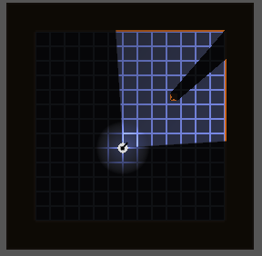

# Godot 4 lighting cone example

This repo is an example of creating a lighting cone (like in Darkwood) using point lights. This was built following the information at [https://docs.godotengine.org/en/stable/tutorials/2d/2d_lights_and_shadows.html](https://docs.godotengine.org/en/stable/tutorials/2d/2d_lights_and_shadows.html)

